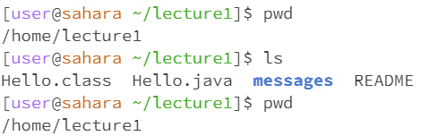
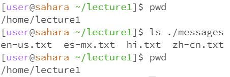
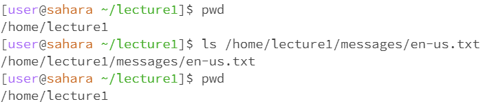
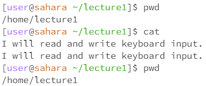
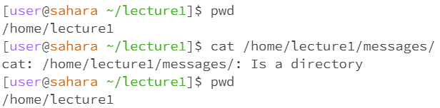
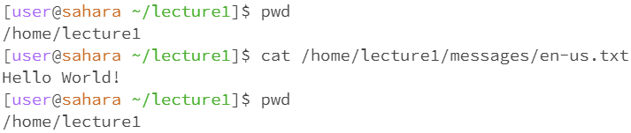

# Lab Report 1

Krishna Rastogi

***
## cd Command With No Arguments
> 

The working directory when the code was run was /home.

When there are no arguments given to the command cd it is the same as giving the argument "./" to change directory so we stay in the same directory. This is not an error because the argument "./" being inputted is just the relative path to the current directory so we will stay in the same directory.

## cd Command With Path to a Directory
> 

The working directory when the code was run was /home.

The argument given is a relative path from home into the lecture1 directory and then into the messages directory. The lecture1 directory is in the home directory and the messages directory is in the lecture1 directory so the path given was valid and therefore no errors occurred.

## cd Command With Path to a File
> 

The working directory when the code was run was /home/lecture1/messages.

The argument given is a relative path from messages to the text file inside it named en-us.txt. However, since cd stands for change _directory_ and we used a files location as the argument, an error occurred stating that the path specified was not a directory.

## ls Command With No Arguments
> 

The working directory when the code was run was /home/lecture1.

When there are no arguments given to the command ls it lists the contents of the working directory because having no argument is the same as inputting "./". "./" is the relative path to the working directory so the ls command lists what is in the working directory. Therefore, the command worked exactly as it should have so there is no error.

## ls Command With Path to a Directory
> 

The working directory when the code was run was /home/lecture1.

The argument given is a relative path from the working directory into the messages directory. The messages directory is in the lecture1 directory so the path given was valid and then the contents of the messages directory were listed. All of the files in the messages directory were properly listed in order so no errors occurred.

## ls Command With Path to a File
> 

The working directory when the code was run was /home/lecture1.

The argument given is a valid absolute path to a text file inside of the messages directory and the ls command returned the given argument back. If an absolute path was given, then it would output the same absolute path and if a relative path was given, then the same relative path would be outputted. If an invalid path was given as an argument, there would be an error, but in this case the argument was a valid path so there was no error. The ls command is used to display the contents of a _directory_ in a list and since the paths given were _files_ it simply returned the same path it was given.

## cat Command With No Arguments
> 

The working directory when the code was run was /home/lecture1.

When there are no arguments given to the command cat, instead of reading a file and writing it in standard form like it would usually be used for, it reads from keyboard inputs that are given and writes them in the next line. It will keep waiting to read from more and more keyboard input until an End-of-File signal is given. In this case, I gave the keyboard input "I will read and write keyboard input." and it returned the same thing that it read. Then I gave the End-of-File signal and the cat command stopped reading my keyboard inputs. No errors occurred as reading and writing keyboard input is a potential use of the cat command.

## cat Command With Path to a Directory
> 

The working directory when the code was run was /home/lecture1.

The argument given is an absolute path to the messages directory. Since the "cat" command is used to view the contents of _files_ in the terminal and the path given is to a _directory_, there was an error and I recieved a message that the path specified is to a directory. Hence, an error occured when a path to a directory is used as the parameter for the "cat" command.

## cat Command With Path to a File
> 

The working directory when the code was run was /home/lecture1.

The argument given is a valid absolute path to a text file inside of the messages directory and the ls command returned the given argument back. If an absolute path was given, then it would output the same absolute path and if a relative path was given, then the same relative path would be outputted. If an invalid path was given as an argument, there would be an error, but in this case the argument was a valid path so there was no error. The ls command is used to display the contents of a _directory_ in a list and since the paths given were _files_ it simply returned the same path it was given.
