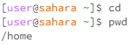
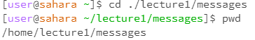

# Lab Report 1

***

## cd Command With No Arguments

The working directory when the code was run was /home.

When there are no arguments given to the command cd it just means that there is no path given to change directory to so we stay in the same directory. This is not an error because leaving the argument blank is the same as the argument "./" being inputted which is just the relative path to the current directory.

## cd Command With Path to a Directory

The working directory when the code was run was /home.

The argument given is a relative path from home into the lecture1 directory and then into the messages directory. The lecture1 directory is in the home directory and the messages directory is in the lecture1 directory so the path given was valid and therefore no errors occurred.

The working directory when the code was run was /home.

When there are no arguments given to the command cd it just means that there is no path given to change directory to so we stay in the same directory. This is not an error because leaving the argument blank is the same as the argument "./" being inputted which is just the relative path to the current directory.

## ls command

The working directory when the code was run was /home.

When there are no arguments given to the command cd it just means that there is no path given to change directory to so we stay in the same directory. This is not an error because leaving the argument blank is the same as the argument "./" being inputted which is just the relative path to the current directory.

***

The working directory when the code was run was /home.

When there are no arguments given to the command cd it just means that there is no path given to change directory to so we stay in the same directory. This is not an error because leaving the argument blank is the same as the argument "./" being inputted which is just the relative path to the current directory.

***

The working directory when the code was run was /home.

When there are no arguments given to the command cd it just means that there is no path given to change directory to so we stay in the same directory. This is not an error because leaving the argument blank is the same as the argument "./" being inputted which is just the relative path to the current directory.

***

The working directory when the code was run was /home.

When there are no arguments given to the command cd it just means that there is no path given to change directory to so we stay in the same directory. This is not an error because leaving the argument blank is the same as the argument "./" being inputted which is just the relative path to the current directory.

***

The working directory when the code was run was /home.

When there are no arguments given to the command cd it just means that there is no path given to change directory to so we stay in the same directory. This is not an error because leaving the argument blank is the same as the argument "./" being inputted which is just the relative path to the current directory.

***

The working directory when the code was run was /home.

When there are no arguments given to the command cd it just means that there is no path given to change directory to so we stay in the same directory. This is not an error because leaving the argument blank is the same as the argument "./" being inputted which is just the relative path to the current directory.

